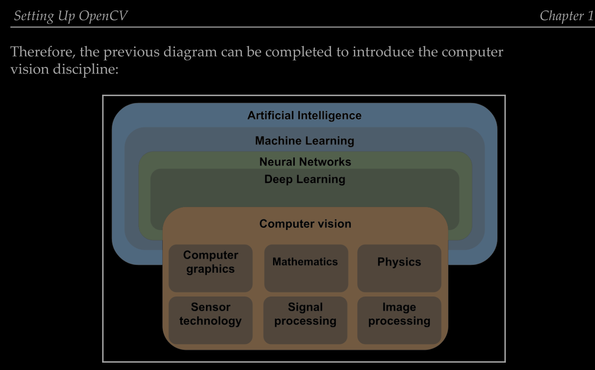
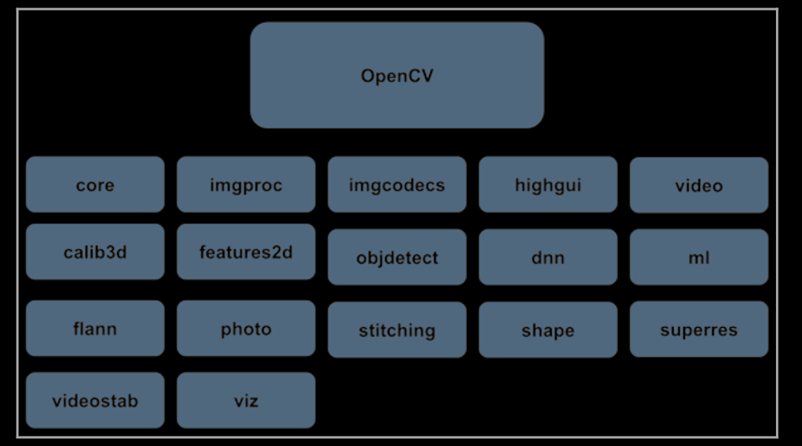
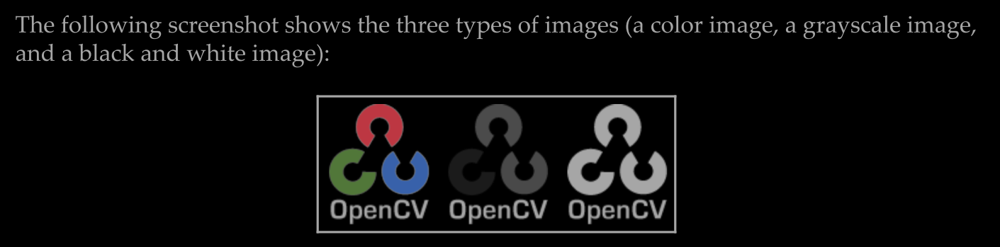
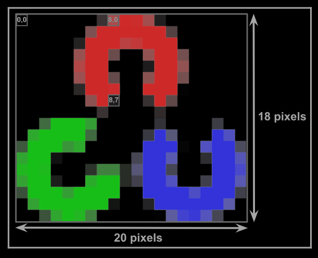
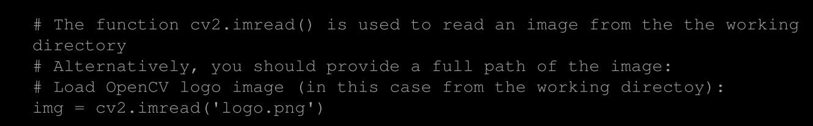
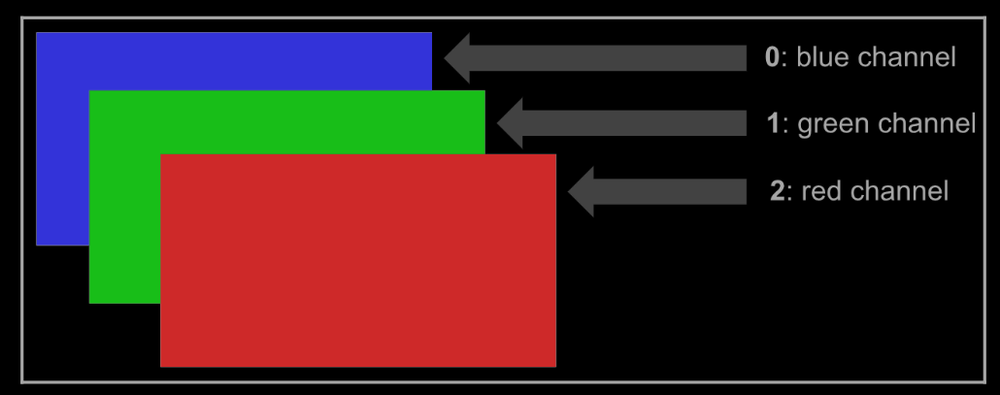
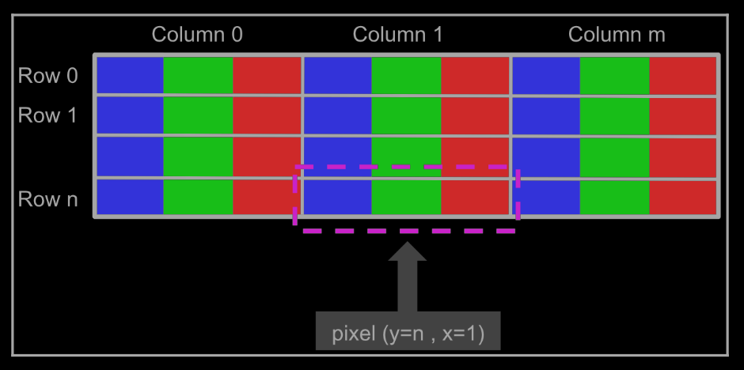

# Computer Vision

1.1 Introducción a OpenCV
2.2 Fundamentos de la clasificación de imágenes
3.2 Detección de Iconos mediante Template Matching
4.4 Dibujo de figuras mediante OpenCV

Computer vision is an interdisciplinary field of Artificial Intelligence that aims to give computers and other devices with computing capabilities a high-level understanding from both digital images and videos, including functionality for acquiring, processing, and analyzing digital images. This is why computer vision is, partly, another sub-area of Artificial Intelligence, heavily relying on machine learning and deep learning algorithms to build computer vision applications. Additionally, Computer vision is composed of several technologies working together—Computer graphics, Image processing, Signal processing, Sensor technology, Mathematics, or even Physics.




# OpenCV
OpenCV is a programming library with real-time computer vision capabilities and it is free for both academic and commercial use (BSD license). In this section, an introduction about the OpenCV library will be given, including its main modules and other useful information in connection with the library

OpenCV is a C++ programming library, with real-time capabilities. As it is written in optimized C/C++, the library can profit from multi-core processing

In connection with the OpenCV library, here are some reasons for its popularity:

- Open source computer vision library OpenCV (BSD license—https:/ / en. wikipedia. org/ wiki/ BSD_ licenses) is free 
- Specific library for image processing
- It has more than 2,500 optimized algorithms, including state-of-the-art computer vision algorithms
- Machine learning and deep learning support The library is optimized for performance
- There is a big community of developers using and supporting OpenCV It has C++, Python, Java, and MATLAB interfaces 
- The library supports: Windows, Linux, Android, and macOS Fast and regular updates (official releases now occur every six months)

OpenCV (since version 2) is divided into several modules, where each module can be understood, in general, as being dedicated to one group of computer vision problems. This division can be seen in the next diagram, where the main modules are shown:



## Subdivision

- core: Core functionality. Core functionality is a module defining basic data structures and also basic functions used by all other modules in the library. 

- imgproc: Image processing. An image-processing module that includes image filtering, geometrical image transformations, color space conversion, and histograms.

- imgcodecs: Image codecs. Image file reading and writing.

- videoio: Video I/O. An interface to video capturing and video codecs.

- highgui: High-level GUI. An interface to UI capabilities. It provides an interface to easily do the following:
    Create and manipulate windows that can display/show images
    Add trackbars to the windows, keyboard commands, and handle mouse events

- video: Video analysis. A video-analysis module including background subtraction, motion estimation, and object-tracking algorithms.

- calib3d: Camera calibration and 3D reconstruction. Camera calibration and 3D reconstruction covering basic multiple-view geometry algorithms, stereo correspondence algorithms, object pose estimation, both single and stereo camera calibration, and also 3D reconstruction.

- features2d: 2D features framework. This module includes feature detectors, descriptors, and descriptor matchers.

- objdetect: Object detection. Detection of objects and instances of predefined classes (for example, faces, eyes, people, and cars).

- dnn: Deep neural network (DNN) module. This module contains the following: 
    API for new layers creation 
    Set of built useful layers
    API to construct and modify neural networks from layers 
    Functionality for loading serialized networks models from different deep learning frameworks

- ml: Machine learning. The Machine Learning Library (MLL) is a set of classes and methods that can be used for classification, regression, and clustering purposes.

- flann: Clustering and search in multi-dimensional spaces. Fast Library for Approximate Nearest Neighbors (FLANN) is a collection of algorithms that are highly suited for fast nearest-neighbor searches.

- photo: Computational photography. This module provides some functions for computational photography.

- stitching: Images stitching. This module implements a stitching pipeline that performs automatic panoramic image stitching.

- shape: Shape distance and matching. Shape distance and matching module that can be used for shape matching, retrieval, or comparison.

- superres: Super-resolution. This module contains a set of classes and methods that can be used for resolution enhancement.

- videostab: Video stabilization. This module contains a set of classes and methods for video stabilization.

- viz: 3D visualizer. This module is used to display widgets that provide several methods to interact with scenes and widgets.

It should be taken into account that OpenCV is robust enough to support realworld applications. That is why OpenCV can be used for non-commercial and commercial products. For example, it is used by companies such as Google, Microsoft, Intel, IBM, Sony, and Honda. Research institutes in leading universities, such as MIT, CMU, or Stanford, provide support for the library.

## OpenCV Applications
OpenCV is being used for a very wide range of applications: 
- 2D and 3D feature toolkits 
- Street view image stitching 
- Egomotion estimation 
- Facial-recognition system 
- Gesture recognition
- Human-computer interaction 
- Mobile robotics
- Motion understanding 
- Object identification
- Automated inspection and surveillance 
- Segmentation and recognition 
- Stereopsis stereo vision – depth perception from two cameras 
- Medical image analysis 
- Structure from motion 
- Motion tracking 
- Augmented reality
- Video/image search and retrieval
- Robot and driverless car navigation and control 
- Driver drowsiness and distraction detection

# Image Basics in OpenCV
Images are a key component in a computer vision project because they provide, in many cases, the input to work with.

The first concept to introduce is related to images, which can be seen as a two-dimensional (2D) view of a 3D world. A digital image is a numeric representation, normally binary, of a 2D image as a finite set of digital values, which are called pixels

Therefore, the goal of computer vision is to transform this 2D data into the following:

- A new representation (for example, a new image)
- A decision (for example, perform a concrete task)
- A new result (for example, correct classification of the image)
- Some useful information extraction (for example, object detection)

Computer vision may tackle common problems (or difficulties) when dealing with imageprocessing techniques:
Ambiguous images because they are affected by perspective, which can produce changes in the visual appearance of the image. For example, the same object viewed from different perspectives can result in different images. Images commonly affected by many factors, such as illumination, weather, reflections, and movements.

Objects in the image may also be occluded by other objects, making it difficult to detect or classify the occluded ones. Depending on the level of the occlusion, the required task (for example, classification of an image into some predefined categories) can be really challenging.

An image can be described as a 2D function, f(x,y), where (x,y) are the spatial coordinates and the value of f at any point, (x,y), is proportional to the brightness or gray levels of the image. Additionally, when both (x,y) and brightness values of f are all finite discrete quantities, the image is called a digital image. Therefore, f(x,y) takes the following values:

x ∈ [0, h-1], where h is the height of the image
y ∈ [0, w-1], where w is the width of the image
f(x,y) ∈ [0, L-1], where L = 256 (for an 8-bit image)

A color image can be represented in the same way, but we need to define three functions to represent the red, green, and blue values, respectively. Each of these three individual functions follows the same formulation as the f(x,y) function that was defined for grayscale images. We will denote these three functions subindex R, G and B for the three formulations (for the color images) as: 

- fR(x,y) 
- fG(x,y) 
- fB(x,y)

A black and white image follows the same approximation in the way that only one function is required to represent the image. However, one key point is that f(x,y) can only take two values. Usually, these values are 0 (black) and 255 (white).

These three types of images are commonly used in computer vision, so remember their formulation.



grayscale and black and white images have only one sample per point (only one function is needed) and color images have three samples per point (three functions are needed—corresponding to the red, green, and blue components of the image).

# Concepts of pixels, colors, channels, images, and color spaces

The RGB model is an additive color model in which the primary colors (R, G, B) are mixed together to reproduce a broad range of colors. As we previously stated, in the RGB model, the primary colors are red, green, and blue.
Each primary color, (R, G, B), is usually called a channel, which is commonly represented as an integer value in the [0, 255] range.

Therefore, each channel produces a total of 256 discrete values, which corresponds to the total number of bits that are used to represent the color channel value (28=256). Additionally, since there are three different channels, this is called a 24-bit color depth:

In the previous diagram, you can see the additive color property of the RGB color space:
Adding red to green gives yellow 
Adding red to blue produces magenta 
Adding green to blue generates cyan
Adding all three primary colors together produces white

An image with a resolution of 800 × 1,200 is a grid with 800 columns and 1,200 rows, containing 800 × 1,200 = 960,000 pixels. It should be noted that knowing how many pixels are in an image does not indicate its physical dimensions (one pixel does not equal one millimeter). Instead, how large a pixel is (and hence, how large an image will be) will depend on the pixels per inch (PPI) that have been set for that image. A general rule of thumb is to have a PPI in the range of [200 - 400].

The basic equation for calculating PPI is as follows: 
PPI = width(pixels)/width of image (inches) 
PPI = height(pixels)/height of image (inches) 
So, for example, if you want to print a 4 × 6 inch image, and your image is
800 × 1,200, the PPI will be 200.


# File extensions

Although the images we are going to manipulate in OpenCV can be seen as rectangular arrays of RGB triplets (in the case of RGB images), they are not necessarily created, stored, or transmitted in that format. In this sense, some file formats, such as GIF, PNG, bitmaps, or JPEG, use different forms of compression (lossless or lossy) to represent images more efficiently.
In this way, and for the sake of completeness, a brief introduction to these image files is given here, with a special focus on the file formats supported by OpenCV. The following file formats (with the associated file extensions) are supported by OpenCV:

Windows bitmaps: *.bmp and *.dib 
JPEG files: *.jpeg, *.jpg, and *.jpe 
JPEG 2000 files: *.jp2 Portable 
Network Graphics: *.png 
Portable image format: *.pbm, *.pgm, and *.ppm 
TIFF files: *.tiff and *.tif

The lossless and lossy types of compression algorithms are applied to the image, resulting in images that are smaller than the uncompressed image. On the one hand, in lossless compression algorithms, the resulting image is equivalent to the original, meaning that after reversing the compression process, the resulting image is equivalent (equal) to the original. On the other hand, in lossy compression algorithms, the resulting image is not equivalent to the original, meaning that some details in the image are lost. In this sense, in many lossy compression algorithms, the level of compression can be adjusted.

# The coordinate system in OpenCV

Now, we are going to look at the indexing of the pixels in the form (x,y). Notice that pixels are zero-indexed, meaning that the upper left corner is at (0, 0), not (1, 1). Take a look at the following image, which indexes three individual pixels. As you can see, the upper left corner of the image is the coordinates of the origin. Moreover, y coordinates get larger as they go down:



The information for an individual pixel can be extracted from an image in the same way as an individual element of an array is referenced in Python. In the next section, we are going to see how we can do this.

# Accessing and manipulating pixels in OpenCV

If you want to work with many pixels at a time, you need to create Region of Image (ROI). In this section, you will learn how to do this. Finally, you will learn how to split and merge images.

Remember that in Python, images are represented as NumPy arrays. Therefore, most of the operations that are included in these examples are related to NumPy, so a good understanding about the NumPy package is required to both understand the code included in these examples and to write optimized code with OpenCV

First, read the image to work with using the cv2.imread() function. The image should be in the working directory, or a full path to the image should be provided. In this case, we are going to read the logo.png image and store it in the img variable:



# RGB vs BGR

We already mentioned that OpenCV uses the BGR color format instead of the RGB one.
This can be seen in the following diagram, where you can see the order of the three channels:



The pixel structure of a BGR image can be seen in the following diagram. In particular, we have detailed how to access pixel (y=n, x=1) for clarification purposes:



Initial developers at OpenCV chose the BGR color format (instead of the RGB one) because at the time, the BGR color format was very popular among software providers and camera manufacturers. For example, in Windows, when specifying a color value using COLORREF, they used the BGR format

In summary, BGR was chosen for historical reasons.

Additionally, other Python packages use the RGB color format. Therefore, we need to know how to convert an image from one format into the other. For example, Matplotlib uses the RGB color format. Matplotlib (https:/ / matplotlib. org/ ) is the most popular 2D Python plotting library and offers you a wide variety of plotting methods.

Therefore, a good choice for your projects is to show the images using the Matplotlib package instead of the functionality offered by OpenCV. Now we are going to see now how we can deal with the different color formats in the two libraries.

# Converting an image from BGR to RGB
First of all, we load the image using the cv2.imread() function:

```python
# Load image using cv2.imread: 
img_OpenCV = cv2.imread('logo.png')
```

The image is stored in the img_OpenCV variable because the cv2.imread() function loads the image in BGR order. Then, we split the loaded image into its three channels, (b, g, r), using the cv2.split() function. The parameter of this function is the image we want to split:

```python

# Split the loaded image into its three channels (b, g, r): 
b, g, r = cv2.split(img_OpenCV)
```

The next step is to merge the channels again (in order to build a new image based on the information provided by the channels) but in a different order. We change the order of the b and r channels in order to follow the RGB format, that is, the one we need for Matplotlib:

Finally, we merge the three channels using the cv2.merge() function. The parameter of this function is a list containing the three channels (in the order of the RGB color format):

```python
# Merge again the three channels but in the RGB format: 
img_matplotlib = cv2.merge([r, g, b])
```

At this point, we have two images (img_OpenCV and img_matplotlib), which are going to be plotted with both OpenCV and Matplotlib so that we can see the results. First of all, we will show these two images with Matplotlib.
To show the two images with Matplotlib in the same window, we will use subplot, which places multiple images within the same window. You have three parameters to use within subplot, for example subplot(m,n,p). In this case, subplot handles plots in a m x n grid, where m establishes the number of rows, n establishes the number of columns, and p establishes where you want to place your plot in the grid. To show the images with Matplotlib, we will use imshow.


# Template Matching

Template Matching is a method for searching and finding the location of a template image in a larger image. OpenCV comes with a function cv.matchTemplate() for this purpose. It simply slides the template image over the input image (as in 2D convolution) and compares the template and patch of input image under the template image. Several comparison methods are implemented in OpenCV. (You can check docs for more details). It returns a grayscale image, where each pixel denotes how much does the neighbourhood of that pixel match with template.

If input image is of size (WxH) and template image is of size (wxh), output image will have a size of (W-w+1, H-h+1). Once you got the result, you can use cv.minMaxLoc() function to find where is the maximum/minimum value. Take it as the top-left corner of rectangle and take (w,h) as width and height of the rectangle. That rectangle is your region of template.

Template matching is a technique for finding areas of an image that are similar to a patch (template). It is a method for searching and finding the location of a template image in a larger image. OpenCV comes with a function cv2.matchTemplate() for this purpose. It simply slides the template image over the input image (as in 2D convolution) and compares the template and patch of input image under the template image. Several comparison methods are implemented in OpenCV. It returns a grayscale image, where each pixel denotes how much does the neighbourhood of that pixel match with template.

## Template Matching in OpenCV
OpenCV comes with a function cv2.matchTemplate() for this purpose. It simply slides the template image over the input image (as in 2D convolution) and compares the template and patch of input image under the template image. Several comparison methods are implemented in OpenCV. It returns a grayscale image, where each pixel denotes how much does the neighbourhood of that pixel match with template.


