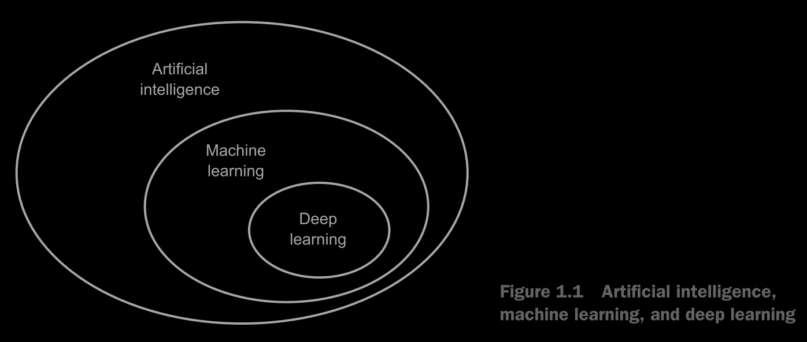
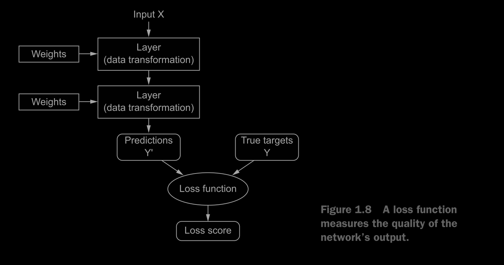

# Deep Learning

# Artificial Intelligence
Concisely, AI can be described as the effort to automate intellectual tasks normally performed by humans. As such, AI is a general field that encompasses machine learning and deep learning, but that also includes many more approaches that may not involve any learning.

In fact, for a fairly long time, most experts believed that human-level artificial intelligence could be achieved by having programmers handcraft a sufficiently large set of explicit rules for manipulating knowledge stored in explicit databases. This approach is known as symbolic AI

# Machine Learning
Machine learning turns this around: the machine looks at the input data and the corresponding answers, and figures out what the rules should be (see figure 1.2). A machine learning system is trained rather than explicitly programmed. It’s presented with many examples relevant to a task, and it finds statistical structure in these examples that eventually allows the system to come up with rules for automating the task. For instance, if you wished to automate the task of tagging your vacation pictures, you could present a machine learning system with many examples of pictures already tagged by humans, and the system would learn statistical rules for associating specific pictures to specific tags.

Although machine learning only started to flourish in the 1990s, it has quickly become the most popular and most successful subfield of AI, a trend driven by the availability of faster hardware and larger datasets.

Unlike statistics, machine learning tends to deal with large, complex datasets (such as a dataset of millions of images, each consisting of tens of thousands of pixels) for which classical statistical analysis such as Bayesian analysis would be impractical. As a result, machine learning, and especially deep learning, exhibits comparatively little mathematical theory—maybe too little—and is fundamentally an engineering discipline.

So that’s what machine learning is, concisely: searching for useful representations
and rules over some input data, within a predefined space of possibilities, using guidance from a feedback signal. This simple idea allows for solving a remarkably broad range of intellectual tasks, from speech recognition to autonomous driving.

# Deep Learning
So, to do machine learning, we need three things:  Input data points—For instance, if the task is speech recognition, these data points could be sound files of people speaking. If the task is image tagging, they could be pictures.
 Examples of the expected output—In a speech-recognition task, these could be human-generated transcripts of sound files. In an image task, expected outputs could be tags such as “dog,” “cat,” and so on.
 A way to measure whether the algorithm is doing a good job—This is necessary in order to determine the distance between the algorithm’s current output and its expected output. The measurement is used as a feedback signal to adjust the way the algorithm works. This adjustment step is what we call learning.

A machine learning model transforms its input data into meaningful outputs, a process that is “learned” from exposure to known examples of inputs and outputs. Therefore, the central problem in machine learning and deep learning is to meaningfully transform data: in other words, to learn useful representations of the input data at hand—representations that get us closer to the expected output

# Deep Deep Learning

Deep learning is a specific subfield of machine learning: a new take on learning representations from data that puts an emphasis on learning successive layers of increasingly meaningful representations. The “deep” in “deep learning” isn’t a reference to any kind of deeper understanding achieved by the approach; rather, it stands for this idea of successive layers of representations.

How many layers contribute to a model of the data is called the depth of the model. Other appropriate names for the field could have been layered representations learning or hierarchical representations learning.

Deep Learning is a subset of machine learning that operates on large volumes of unstructured data, such as human speech, text, and images. A deep learning model is an artificial neural network that comprises multiple layers of mathematical computation on data, where results from one layer are fed as input into the next layer in order to classify the input data and/or make a prediction.

Modern deep learning often involves tens or even hundreds of successive layers of representations, and they’re all learned automatically from exposure to training data. Meanwhile, other approaches to machine learning tend to focus on learning only one or two layers of representations of the data (say, taking a pixel histogram and then applying a classification rule); hence, they’re sometimes called shallow learning.

In deep learning, these layered representations are learned via models called neural networks, structured in literal layers stacked on top of each other.

You can think of a deep network as a multistage informationdistillation process, where information goes through successive filters and comes out increasingly purified (that is, useful with regard to some task).

So that’s what deep learning is, technically: a multistage way to learn data representations. It’s a simple idea—but, as it turns out, very simple mechanisms, sufficiently scaled, can end up looking like magic. 

At this point, you know that machine learning is about mapping inputs (such as images) to targets (such as the label “cat”), which is done by observing many examples of input and targets. You also know that deep neural networks do this input-to-target mapping via a deep sequence of simple data transformations (layers) and that these
data transformations are learned by exposure to examples. Now let’s look at how this learning happens, concretely.

The primary reason deep learning took off so quickly is that it offered better performance for many problems. But that’s not the only reason. Deep learning also makes problem-solving much easier, because it completely automates what used to be the most crucial step in a machine learning workflow: feature engineering.

Previous machine learning techniques—shallow learning—only involved transforming the input data into one or two successive representation spaces, usually via simple transformations such as high-dimensional non-linear projections (SVMs) or decision trees.

they had to manually engineer good layers of representations for their data. This is called feature engineering.

Deep learning, on the other hand, completely automates this step: with deep learning, you learn all features in one pass rather than having to engineer them yourself. This has greatly simplified machine learning workflows, often replacing sophisticated multistage pipelines with a single, simple, end-to-end deep learning model.

With joint feature learning, whenever the model adjusts one of its internal features, all other features that depend on it automatically adapt to the change, without requiring human intervention. Everything is supervised by a single feedback signal: every change in the model serves the end goal. This is much more powerful than greedily stacking shallow models, because it allows for complex, abstract representations to be learned by breaking them down into long series of intermediate spaces (layers); each space is only a simple transformation away from the previous one.

These are the two essential characteristics of how deep learning learns from data: the incremental, layer-by-layer way in which increasingly complex representations are developed,and the fact that these intermediate incremental representations are learned jointly, each layer being updated to follow both the representational needs of the layer above and the needs of the layer below. Together, these two properties have made deep learning vastly more successful than previous approaches to machine learning.

# Learning
Learning, in the context of machine learning, describes an automatic search process for data transformations that produce useful representations of some data, guided by some feedback signal—representations that are amenable to simpler rules solving the task at hand.

# What is a Representation?
Before we go any further: what’s a representation? At its core, it’s a different way to
look at data—to represent or encode data. For instance, a color image can be encoded in the RGB format (red-green-blue) or in the HSV format (hue-saturation-value): these are two different representations of the same data. Some tasks that may be difficult with one representation can become easy with another. For example, the task “select all red pixels in the image” is simpler in the RGB format, whereas “make the image less saturated” is simpler in the HSV format. Machine learning models are all about finding appropriate representations for their input data—transformations of the data that make it more amenable to the task at hand

 

# Neural Networks
The term “neural network” refers to neurobiology, but although some of the central concepts in deep learning were developed in part by drawing inspiration from our understanding of the brain (in particular, the visual cortex)
deep learning models are not models of the brain. There’s no evidence that the brain implements anything like the learning mechanisms used in modern deep learning models.

Neural Networks are computer models for machine learning that are based on the structure and functioning of the biological brain. An artificial neuron processes a plurality of input signals and, in turn, when the sum of the input signals exceeds a certain threshold value, signals to further adjacent neurons will be sent.

For our purposes, deep learning is a mathematical framework for learning representations from data.

The specification of what a layer does to its input data is stored in the layer’s
weights, which in essence are a bunch of numbers. In technical terms, we’d say that the transformation implemented by a layer is parameterized by its weights, (Weights are also sometimes called the parameters of a layer.)
In this context, learning means finding a set of values for the weights of all layers in a network, such that the network will correctly map example inputs to their associated targets.

To control something, first you need to be able to observe it. To control the output of a neural network, you need to be able to measure how far this output is from what you expected. This is the job of the loss function of the network, also sometimes called the objective function or cost function.

The loss function takes the predictions of the network and the true target (what you wanted the network to output) and computes a distance score, capturing how well the network has done on this specific example

The fundamental trick in deep learning is to use this score as a feedback signal to adjust the value of the weights a little, in a direction that will lower the loss score for the current example (see figure 1.9). This adjustment is the job of the optimizer, which implements what’s called the Backpropagation algorithm: the central algorithm in deep learning.

The fundamental trick in deep learning is to use this score as a feedback signal to adjust the value of the weights a little, in a direction that will lower the loss score for the current example (see figure 1.9). This adjustment is the job of the optimizer, which implements what’s called the Backpropagation algorithm: the central algorithm in deep learning.

But with every example the network processes, the weights are adjusted a little in the correct direction, and the loss score decreases. This is the training loop, which, repeated a sufficient number of times (typically tens of iterations over thousands of examples), yields weight values that minimize the loss function.

In particular, deep learning has enabled the following breakthroughs, all in historically difficult areas of machine learning: 

 Near-human-level image classification 
 Near-human-level speech transcription 
 Near-human-level handwriting transcription
 Dramatically improved machine translation 
 Dramatically improved text-to-speech conversion 
 Digital assistants such as Google Assistant and Amazon Alexa 
 Near-human-level autonomous driving  Improved ad targeting, as used by Google, Baidu, or Bing  Improved search results on the web  Ability to answer natural language questions  Superhuman Go playing

# Early neural networks

The first successful practical application of neural nets came in 1989 from Bell
Labs, when Yann LeCun combined the earlier ideas of convolutional neural networks and backpropagation, and applied them to the problem of classifying handwritten digits. The resulting network, dubbed LeNet, was used by the United States Postal Service in the 1990s to automate the reading of ZIP codes on mail envelopes.

# Decision trees, random forests, and gradient boosting machines, gradient boosting machines

A gradient boosting machine, much like a random forest, is a machine learning technique based on ensembling weak prediction models, generally decision trees. It uses gradient boosting, a way to improve any machine learning model by iteratively training new models that specialize in addressing the weak points of the previous models. Applied to decision trees, the use of the gradient boosting technique results in models that strictly outperform random forests most of the time, while having similar properties. It may be one of the best, if not the best, algorithm for dealing with nonperceptual data today. Alongside deep learning, it’s one of the most commonly used techniques in Kaggle competitions.

From 2016 to 2020, the entire machine learning and data science industry has been dominated by these two approaches: deep learning and gradient boosted trees. Specifically, gradient boosted trees is used for problems where structured data is available, whereas deep learning is used for perceptual problems such as image classification.

Users of gradient boosted trees tend to use Scikit-learn, XGBoost, or LightGBM. Meanwhile, most practitioners of deep learning use Keras, often in combination with its parent framework TensorFlow. The common point of these tools is they’re all Python libraries: Python is by far the most widely used language for machine learning and data science.

These are the two techniques you should be the most familiar with in order to be
successful in applied machine learning today: gradient boosted trees, for shallowlearning problems; and deep learning, for perceptual problems.

# Limitations
The two key ideas of deep learning for computer vision—convolutional neural networks and backpropagation—were already well understood by 1990. The Long Short-Term Memory (LSTM) algorithm, which is fundamental to deep learning for timeseries, was developed in 1997 and has barely changed since. So why did deep learning only take off after 2012? What changed in these two decades? In general, three technical forces are driving advances in machine learning: 

 Hardware 
 Datasets and benchmarks 
 Algorithmic advances

# Algorithms 
In addition to hardware and data, until the late 2000s, we were missing a reliable way to train very deep neural networks. As a result, neural networks were still fairly shallow, using only one or two layers of representations; thus, they weren’t able to shine against more-refined shallow methods such as SVMs and random forests. The key issue was that of gradient propagation through deep stacks of layers. The feedback signal used to train neural networks would fade away as the number of layers increased. This changed around 2009–2010 with the advent of several simple but important
algorithmic improvements that allowed for better gradient propagation: 

 Better activation functions for neural layers 
 Better weight-initialization schemes, starting with layer-wise pretraining, which was then quickly abandoned
 Better optimization schemes, such as RMSProp and Adam

Only when these improvements began to allow for training models with 10 or more layers did deep learning start to shine. Finally, in 2014, 2015, and 2016, even more advanced ways to improve gradient
propagation were discovered, such as batch normalization, residual connections, and depthwise separable convolutions.

# The mathematical building blocks of neural networks